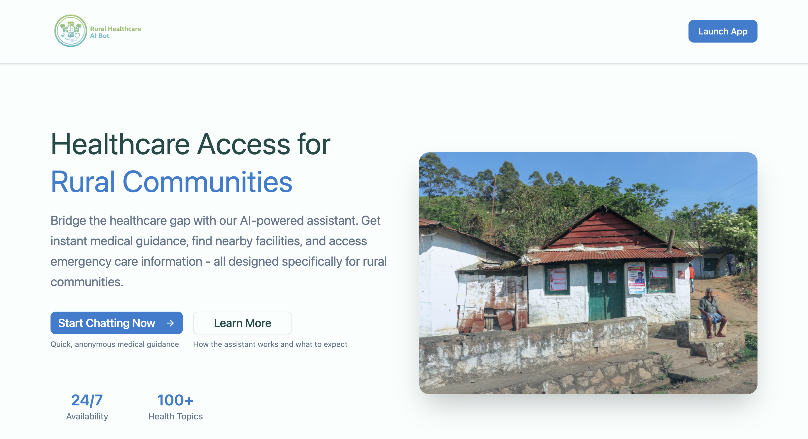
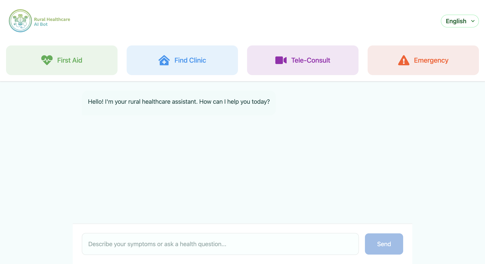

# Healthcare Bot - Your Rural Healthcare Assistant 🏥

## Overview

Healthcare Bot is an AI-powered healthcare assistant designed specifically for rural communities. This project aims to bridge the healthcare accessibility gap in rural areas by providing easy access to basic healthcare information, first-aid guidance, and connecting users with healthcare services in their local area.

## Features 🌟

### 1. Multi-Language Support

- Available in multiple languages including:
  - English
  - Hindi (हिंदी)
  - Marathi (मराठी)
- Making healthcare information accessible to diverse rural communities

### 2. Key Services 🚑

- **First Aid Guidance**

  - Step-by-step instructions for basic first aid
  - Clear safety warnings and precautions
  - When to seek professional help

- **Find Clinic**

  - Help locate nearby healthcare facilities
  - Information about government hospitals
  - Basic details about available services

- **Tele-Consultation**

  - Information about available telemedicine services
  - Connection to verified healthcare platforms
  - Guidance for remote consultations

- **Emergency Services**
  - Quick access to emergency numbers (108)
  - Clear emergency response protocols
  - Safety-first approach with immediate professional help guidance

### 3. Safety Features ⚕️

- Clear distinction between AI assistance and professional medical advice
- Prominent emergency contact information
- Regular reminders to seek professional medical help when needed
- Built-in safety protocols for emergency situations

## Technology Stack 💻

- **Frontend Framework:**

  - React.js with Vite
  - TailwindCSS for styling
  - Responsive and accessible design

- **AI Integration:**

  - Google Gemini AI for intelligent responses
  - Advanced prompt engineering for healthcare context
  - Multi-language support system

- **UI Components:**
  - Custom-designed chat interface
  - Responsive design for all devices
  - Accessibility-focused components

## Getting Started 🚀

### Prerequisites

- Node.js (v14 or higher)
- npm or yarn
- Google Gemini API key

### Installation

1. Clone the repository:
   \`\`\`bash
   git clone https://github.com/CodeX047/Health-Care-bot.git
   \`\`\`

2. Install dependencies:
   \`\`\`bash
   cd Health-Care-bot
   npm install
   \`\`\`

3. Set up environment variables:
   Create a \`.env\` file in the root directory and add:
   \`\`\`env
   VITE_GOOGLE_API_KEY=your_gemini_api_key_here
   \`\`\`

4. Start the development server:
   \`\`\`bash
   npm run dev
   \`\`\`

## Usage Guide 📖

1. Select your preferred language (English, Hindi, or Marathi)
2. Choose from available services:
   - First Aid: Get immediate guidance for basic medical situations
   - Find Clinic: Locate healthcare facilities in your area
   - Tele-Consult: Get information about telemedicine services
   - Emergency: Immediate guidance for emergency situations
3. Follow the chat interface for guided assistance
4. For emergencies, always follow the emergency protocol provided

## Safety Disclaimer ⚠️

Healthcare Bot is an AI assistant designed to provide basic healthcare information and guidance. It is NOT a substitute for professional medical advice, diagnosis, or treatment. Always seek the advice of qualified healthcare providers for medical conditions.

## Contributing 🤝

We welcome contributions to improve Healthcare Bot! Please follow these steps:

1. Fork the repository
2. Create your feature branch (\`git checkout -b feature/AmazingFeature\`)
3. Commit your changes (\`git commit -m 'Add some AmazingFeature'\`)
4. Push to the branch (\`git push origin feature/AmazingFeature\`)
5. Open a Pull Request
